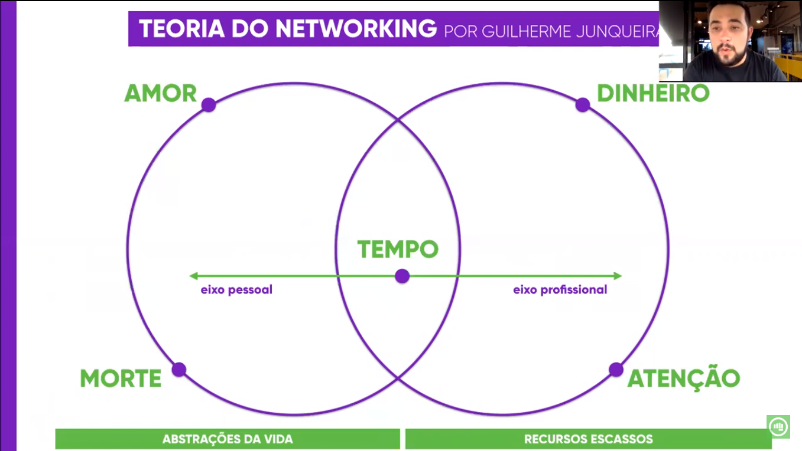
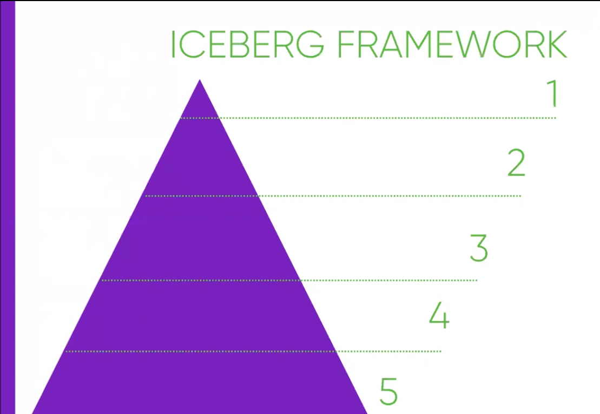

# Hackeando Seu Networking
### **USANDO O ICEBERG FRAMEWORK EM CICLOS DE 4 EM 4 ANOS**

## 1. Como você quer morrer?
- Pergunta decrescente
- Ricardo Nantes - CEO Portal Educação
- Como você gostaria de ser lembrado?
- Qual foi o seu legado?
- O que o mundo perderia?
- O que você faz hoje para chegar no objetivo?

### Exercício - **Como você quer ser lembrado?**
- Reconhecido no mundo corporativo
- Referência/Inspiração para pessoas na excelência de processos
- Ajudar pessoas a se desenvolverem e alcaçarem seus objetivos

## 2. Quem são as pessoas que podem te ajudar a chegar lá?
### Exercício - **Liste 10 pessoas e classifique**

| **ÍNDICE** | **CATEGORIAS** | **INTERESSES** | **PROFUNDIDADE** |
| ---------- | -------------- | -------------- | ---------------- |
| 1.  | | | |
| 2.  | | | |
| 3.  | | | |
| 4.  | | | |
| 5.  | | | |
| 6.  | | | |
| 7.  | | | |
| 8.  | | | |
| 9.  | | | |
| 10. | | | |
||||

## 3. Como você vai conseguir a atenção dessas pessoas?

### **Teoria do Networking**

___

### **Pessoal: Abstrações da Vida**
- Tempo
- Amor
- Morte

Nesse aspecto usamos o nosso tempo para dar e receber amor, antes que a morte chegue. Isso é o eixo pessoal. Tempo gasto com a família, relacionamentos. Filme "A Beleza Oculta" com Will Smith.

### **Profissional: Recursos Escassos**
- Tempo
- Atenção
- Dinheiro

Como conseguir usar o tempo para ter a atenção de alguém "maior" do que você para ganhar dinheiro? Eixo profissional. O único recurso que todas as pessoas do mundo têm em comum diariamente é o tempo, 24h por dia. O objetivo de ter a atenção é ter o contato dessas **pessoas referências** para receber os recursos escassos delas (tempo e atenção) para alcançar o objetivo profissional (dinheiro). "Como chamar e ser chamado pelo seu nome?"

## 4. Quais são as formas de ajudar para ser ajudado?

### **3 Princípios de como lidar com pessoas**
1. Não critique, não condene, não se queixe. **Dê nova oportunidade!**
2. Aprecie de forma honesta e sincera! **Comemore o sucesso dos outros!**
3. Desperte um forte desejo na outra pessoa. **Entender a busca do outro!**

### **3 Princípios de como fazer as pessoas gostarem de você**
1. Torne-se verdadeiramente interessado no outro. 
2. Lembre-se sempre do nome da pessoa.
3. Faça a outra pessoa se sentir importante.

### **3 Princípios de como conquistar as pessoas para o seu modo de pensar**
1. Respeite a opinião dos outros. Nunca diga "você está errado".
2. Se estiver errado, reconheça seu erro de forma rápida e enfática.
3. Procure honestamente ver as coisas do ponto de vista da outra pessoa. **Comunicação é o que o outro entende, não o que você fala! Tenha empatia.**

## 5. Iceberg Framework

- **[Planilha de Relacionamentos](https://docs.google.com/spreadsheets/d/1g-5kaSVMHRBovjxhz_1kOWIjH_4RhrKsgyq6gvaDN2U/edit#gid=0)**
- **[guilherme@gama.academy](mailto:guilherme@gama.academy)**
- **[Hackeando Relacionamentos](https://www.youtube.com/watch?v=WMirX1fJzIQ)**
___

## Minha contribuição com o assignment
Concordo completamente com a visão do Guilherme. Para receber, precisamos primeiramente nos doar. É um lema de vida para mim, inclusive. Acredito que a lição que aprendi na infância de "não faça para os outros o que você não quer que façam para você" se aplica muito bem a esse contexto. Não queremos que as pessoas se aproximem de nós puramente por interesse (claro que existe uma motivação, um objetivo, como foi falado pelo Guilherme no vídeo), dessa forma devemos oferecer algo primeiramente, nem que seja apenas mostrar nossas intenções de contribuição e/ou compartilhamento. Agregar valor de forma mútua, na troca, é o grande lance! Todos ganham e todos crescem!