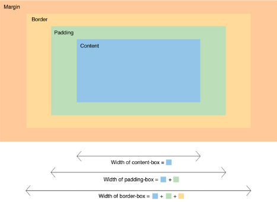

# Módulo 6 - CSS

## Referências para estudos
- **W3Schools** -> https://www.w3schools.com/css/default.asp

___
## O que é CSS?
O acrônimo significa *Cascading Style Sheets*, **Folhas de Estilo em Cascata**.

**CSS** é uma linguagem de criação de estilos, que, quando combinados, resultam em uma **aparência personalizada** para os elementos da página.
___
## Utilizando o CSS
- **CSS inline** `style="propriedade: valor;"` através do atributo `style`, inserido dentro de qualquer **tag HTML**, podemos estilizar **um elemento específico** em uma página
- **CSS interno** entre as tags `<head>` e `</head>` podemos utilizar a **tag** ``
- **CSS externo** podemos utilizar arquivos externos de CSS indicando dentro das tags `<head>` e `</head>` a tag `<link rel="stylesheet" href="caminho_do_arquivo.css">`

___
## O arquivo CSS
Basicamente a instrução CSS segue o seguinte padrão:

    nome_do_seletor {
        propriedade_css: valor_da_propriedade;
    }

### Seletores CSS
Onde **`nome_do_seletor`** pode ser:

- **Uma tag HTML**
    - `body { ... }`
    - `h1 { ... }`
    - `div { ... }`
    - `ul { ... }`
    - `qualquer_tag { ... }`
    - **ATENÇÃO**: Não utilizamos os colchetes angulares `< >` nas instruções CSS, apenas o NOME da tag

- **Uma classe** | `class="sua-classe"`
    - `.botao { ... }`
    - `.titulo-secao { ... }`
    - `.social-icon { ... }`
    - **ATENÇÃO**: classes são indicadas no arquivo CSS com um `.` antes do nome

- **Um Id** | `id="seu-id"`
    - `#txt-unico { ... }`
    - `#navegacao { ... }`
    - `#menu-lateral { ... }`
    - **ATENÇÃO**: ids são indicados no arquivo CSS com um `#` antes do nome

### Propriedades e Valores CSS
Quando falamos da **`propriedade_css`**, existe uma infinidade e iremos utilizar conforme nossa necessidade, bem como o **`valor_da_propriedade`**.

É recomendável que se acesse essa **[lista](https://www.w3schools.com/cssref/default.asp)** do **[W3Schools](https://www.w3schools.com/)** para melhor entendimento das possibilidades.

Todas as propriedades CSS estão organizadas em ordem alfabética. Ao clicar em qualquer propriedade da lista você será direcionado para uma página inteira sobre a especificação dessa propriedade. Nesta página existe uma tabela com todos os possíveis valores aplicáveis para a propriedade.

___
### Box Model
Todos os **elementos HTML** de uma página são como **caixas retangulares** e possuem **margem**, **borda** e **preenchimento (ou espaçamento)** ao redor do seu **conteúdo**. A este conceito damos o nome de Box Model.

Com o CSS podemos manipular os tamanhos dessas áreas utilizando as propriedades `margin`, `border` e `padding`.

Existe também a propriedade `box-sizing` que, atrelada ao valor `border-box` faz com que o tamanho do elemento (`width` e `height`) seja considerado incluindo os valores definidos nas propriedades `margin`, `border` e `padding`.

Para mais informações sobre esse tema, recomendo fortemente o o **[Guia TableLess Para Iniciantes na Web](https://tableless.github.io/iniciantes/)**. Eles tem um artigo falando tudo sobre **[Box Model](https://tableless.github.io/iniciantes/manual/css/box-model.html)**

___
## Flexbox
É um **modelo de layout** que permite que os elementos dentro de um contâiner se auto organizem em relação a tela do dispositivo, conforme as instruções CSS atribuídas a eles.

A página da MDN  traz um excelente artigo explicando esse conceito. Entenda clicando [aqui](https://developer.mozilla.org/pt-BR/docs/Web/CSS/CSS_Flexible_Box_Layout/Conceitos_Basicos_do_Flexbox).