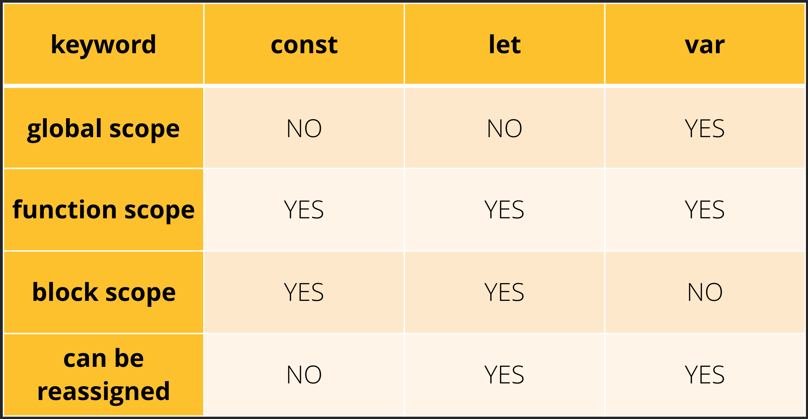

# Módulo 9 - Javascript 1

## Introdução ao Javascript

### Por que aprender JS?

- É a principal linguagem da Web
- Muito requisitada pelo mercado

### Armazenando valores

Existem 3 formas de declararmos variáveis no Javascript `var`, `let` e `const`. Exemplo de declaração de variável:

- `var nome = "Khayan"` // Escopo Global
- `let nome = "Khayan"` // Escopo de bloco
- `const nome = "Khayan"` // Constante **(devem ser inicializadas no momento de sua declaração!)**

### Console

- `console.log("Mensagem para exibir no console")` // Exibe a mensagem
- `console.log(suaVariavel)` // Exibe o conteúdo da variável
- `prompt("Digite seu nome")` // Exibe uma caixa para entrada de dado juntamente com a mensagem definida

## Números e Operações

### Operadores

- Soma `+`
- Subtração `-`
- Divisão `/`
- Multiplicação `*`
- Módulo `%`

Clique **[aqui](operadores.js)** para ver o exemplo aplicado.

## Boas Práticas de Javascript

- Nomes de variáveis devem usar **camelCase**
- Todas as variáveis devem **começar com uma letra**
- Sempre colocar **espaço entre os operadores e depois da vírgula**
- Para indentação use sempre **dois espaços**
- Sempre termine uma instrução simples com `;` (ponto e vírgula)
- Sempre coloque a abertura da chave `{` na mesma linha da função ou objeto
- Use um espaço entre a declaração da função e a abertura da chave `function() {`
- Feche a chave `}` em uma linha isolada
        
        function() {
            // corpo da função
        }

- Não ultrapassar 80 caracteres por linha de código
- Sempre utilize arquivos externos para a sua página HTML invocar o Javascript
- Nomes de arquivos devem ser sempre com caracteres minúsculos `script.js`

## Condicionais

Utilizamos as declarações condicionais para tomar decisões baseadas em condições. As instruções podem ser:

### IF / ELSE

    if (condição) {
        // ações...
    } else {
        // ações, caso a condição não seja verdadeira
    }

### SWITCH / CASE

    switch(teste) {
        case 1:
            // ações do caso 1
        break;

        case 2:
            // ações do caso 2
        break;

        case 3:
            // ações do caso 3
        break;

        case 4:
            // ações do caso 4
        break;

        default:
            // ação padrão
        break;
    }

Clicando **[aqui](condicionais.js)** você poderá ver um exemplo simples dessas estruturas sendo utilizadas.

## Estruturas de Repetição

É uma estrutura que executa um determinado bloco de código durante N vezes, de acordo com a instrução do script.

### For

A instrução `for` cria um loop que consiste em três expressões opcionais, dentro de parênteses e separadas por ponto e vírgula, seguidas por uma declaração ou uma sequência de declarações executadas em sequência. (Referência: [MDN](https://developer.mozilla.org/pt-BR/docs/Web/JavaScript/Reference/Statements/for))

    for ([inicialização]; [condição]; [incremento]) {
        // ações
    }

Clicando **[aqui](for.js)** você poderá ver um exemplo simples dessa estrutura sendo utilizada.

### While

Enquanto algo for verdadeiro, repita a ação. Utilizamos o `while` quando não sabemos exatamente o limite de parada daquela ação. A condição de verificação do `while` também pode ser chamada de `flag`. É a `flag` que auxilia na parada do laço.

A declaração `while` cria um laço que executa uma rotina especifica enquanto a condição de teste for avaliada como verdadeira. A condição é avaliada antes da execução da rotina. (Referência [MDN](https://developer.mozilla.org/pt-BR/docs/Web/JavaScript/Reference/Statements/while))

    while (condição) {
        // ações
    }

Clicando **[aqui](while.js)** você poderá ver um exemplo simples dessa estrutura sendo utilizada.

## Funções

## Classes

## Validador de CPF
### Parte 1
### Parte 2
### Parte 3
### Parte 4
### Parte 5