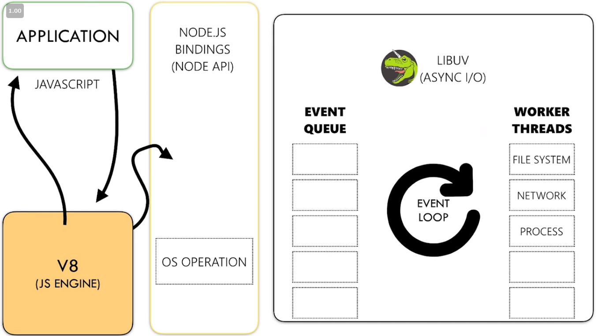
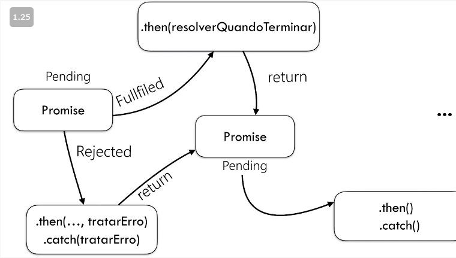

# Módulo 12 - Node.js

## Objetivos do #cursoNodeBR

- Instalação -> App em produção
- Sincronia de funções Javascript
- Manipulação de listas
- Criando ferramentas de linha de comando
- Trabalhando com múltiplos bancos de dados
- Criando serviços profissionais com Hapi.js
- Documentação automática de serviços com Swagger
- Autenticação com JSON Web Token
- Publicação de serviços na Web

## Introdução ao Node.js

### O que **NÃO** é Node.js?

- Uma linguagem de programação
- Ferramenta para criação de sites simples
- Framework Javascript
- Ferramenta para criação de aplicações front-end

### O que **É** Node.js?

- Plataforma para construção de aplicações back-end usando Javascript
- Ferramenta inicialmente criada para resolver o problema de upload de imagens em 2009 (Ryan Dahl)
- Usada também para construção de ferramentas de linha de comando

## Conhecendo o gerenciador de pacotes NPM

- NPM > Node Package Manager
- Gerenciador de dependências Javascript
- Identifica dependências a partir de arquivos `package.json`
- Usado também para executar scripts bash a partir de seu projeto
- **[Site do NPM](https://www.npmjs.com/)**

## Começando um projeto em Node.JS

- Para iniciar um projeto `npm init` ou `npm init -y` para iniciar um projeto com as configurações padrão
- `package.json` é o arquivo de configurações do projeto
- `scripts` personalizados
    - Exemplo `"dev": "node index.js",`
    - No terminal, para rodar o script de exemplo, `npm run dev`
    - O comando vai buscar no `package.json`o script correspondente ao comando e irá executa-lo

## Sincronia de funções Javascript

### Máquina Virtual do JS

- Camada de aplicação Javascript
- V8 - Motor de execução
- Bindings - Convertem JS para C++

Imagem: https://erickwendel.teachable.com/p/node-js-para-iniciantes-nodebr

### Event Loop - Fluxo de Eventos

- Delega eventos para o Sistema Operacional dentro do fluxo do Node
- Quando o SO termina de processar esses eventos ele devolve uma Callback para o Event Loop
- O Event Loop retorna para quem chamou aquele evento

#### Event Loop - Abstração

- while(true) - É um loop que não para de distribuir tarefas para o SO
- É uma fila de tarefas

Imagem: https://erickwendel.teachable.com/p/node-js-para-iniciantes-nodebr

## Entendendo o ciclo de vida Javascript

- Funções que dependem de execução externa serão executadas em background
- A forma como que seu código é escrito é diferente da ordem em que ele é executado
- Importante sempre manter a ordem de sua execução para evitar problemas

## Trabalhando com Callbacks

Callback é uma função que é passada como parâmetro para outra função. Por sua vez, a Callback possui dois parâmetros, erro e sucesso. O exemplo feito em aula pode ser visto **[aqui](callback.js)**.

- **[Entendendo funções callback em JavaScript | Medium](https://medium.com/totvsdevelopers/entendendo-fun%C3%A7%C3%B5es-callback-em-javascript-7b500dc7fa22)**
- **[Função Callback | MDN](https://developer.mozilla.org/pt-BR/docs/Glossario/Callback_function)**
- **[O que é callback? | Stackoverflow](https://pt.stackoverflow.com/questions/27177/o-que-%C3%A9-callback)**

## Promises

>É um objeto usado para processamento assíncrono. Um Promise (de "promessa") representa um valor que pode estar disponível agora, no futuro ou nunca. (**[MDN Web Docs](https://developer.mozilla.org/pt-BR/docs/Web/JavaScript/Reference/Global_Objects/Promise)**)

>A promise represents the eventual result of an asynchronous operation. The primary way of interacting with a promise is through its then method, which registers callbacks to receive either a promise’s eventual value or the reason why the promise cannot be fulfilled. (**[Promises/A+](https://promisesaplus.com/)**)

### Ciclo de Vida | Status

- Pending: Estado inicial, ainda não terminou ou ainda não foi rejeitado
- Fulfilled: Quando executou todas as operações com sucesso
- Rejected: Quando a operação falhou

### Refatorando | Callbacks to Promisses

Exemplo da refatoração feita em aula **[aqui](refatorandoCallbacksToPromisses.js)**.

### Promisses | Async/Await

- Auxiliam na resolução das Promises
- Facilita a visualização do fluxo de funções
- Não altera a performance da aplicação
- Surgiu do C# -> Typescript -> Javascript
- Usar apenas quando necessitar tratar a resposta da chamada

Exemplo da refatoração feita em aula **[aqui](async-await.js)**. É importante utilizar o `Promise.all([])` para resolver as promises de forma correta. O código tende a ficar mais limpo e também mais performático.

O recurso `await` somente deve ser utilizado caso necessário. Caso não haja necessidade em manipular o resultado, ou ainda, não exista dependência entre as respostas das funções, podemos utilizar o `Promises.all([])` para resolver essas tarefas em segundo plano.

## Event Emitter

- Manipulador de ações
- Tudo o que acontece no Node.js acontece a partir de eventos
- Tudo o que é manipulado, é manipulado a partir de eventos
- Usado para ações contínuas (rotinas)
- Node.js usa para quase tudo em seu ecossistema
- Bastante usado também nos browsers (`.onClick`)
- Trabalha sob o padrão - *design pattern* -  **Observer/PubSub**

Exemplos mostrados em aula **[aqui](events.js)**.

## Manipulação de Listas

Clicando **[aqui](manipulando-listas.js)** você pode ver exemplos de manipulação utilizando `for`, `for in` e `for of`.

## Map

Implementação ~~raiz~~ do método `map()`, uso de arrow function e outros exemplos da aula **[aqui](map.js)**.

Mais sobre o `map()` clicando **[aqui](https://developer.mozilla.org/pt-BR/docs/Web/JavaScript/Reference/Global_Objects/Array/map)** *(MDN Web Docs)*.

## Filter

O `filter()` é um método que serve para filtrar a partir de uma condição. Implementação ~~raiz~~ de `filter()` e outros exemplos da aula **[aqui](filter.js)**.

Mais sobre o `filter()` clicando **[aqui](https://developer.mozilla.org/pt-BR/docs/Web/JavaScript/Reference/Global_Objects/Array/filtro)** *(MDN Web Docs)*.

## Reduce

O método `reduce()` retorna um único valor a partir de um `array`. Implementação ~~raiz~~ de `reduce()` e outros exemplos da aula **[aqui](reduce.js)**.

Mais sobre a `reduce()` clicando **[aqui](https://developer.mozilla.org/pt-BR/docs/Web/JavaScript/Reference/Global_Objects/Array/reduce)** *(MDN Web Docs)*.

## Testes automatizados em Javascript | Mocha + Nock

- Instalação global do **[Mocha](https://www.npmjs.com/package/mocha)**: `npm i -g mocha`
- Dependência de desenvolvimento: `npm i --save-dev mocha`
- Instalação do **[Nock](https://www.npmjs.com/package/nock)** package para simular requisições: `npm i nock`

Para visualizar a implementação de exemplo clique **[aqui](./tests/01)** ou, separadamente, nos arquivos **[service.js](./tests/01/service.js)** e **[tests.js](./tests/01/service.js)**.